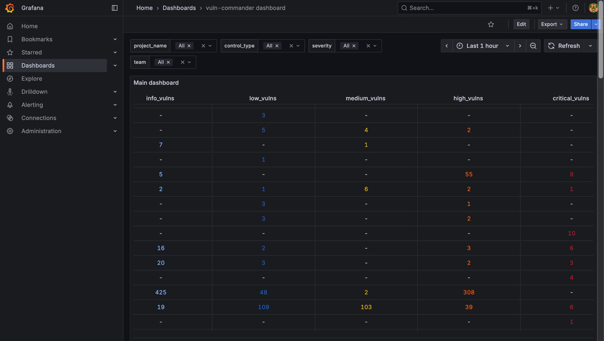
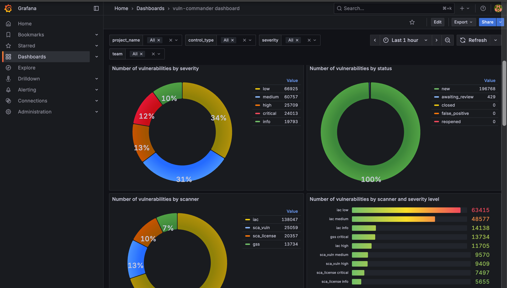
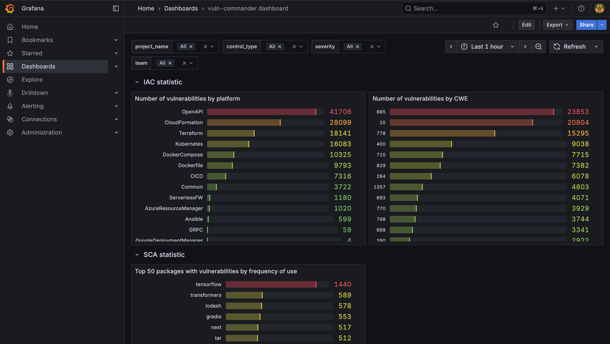
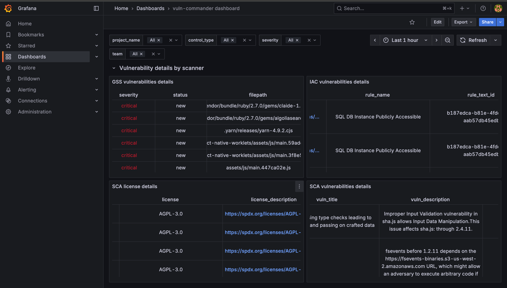
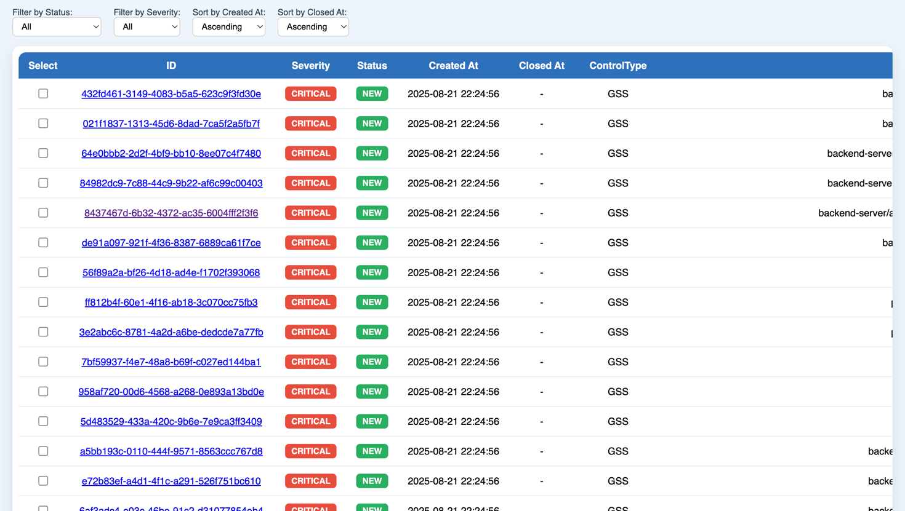
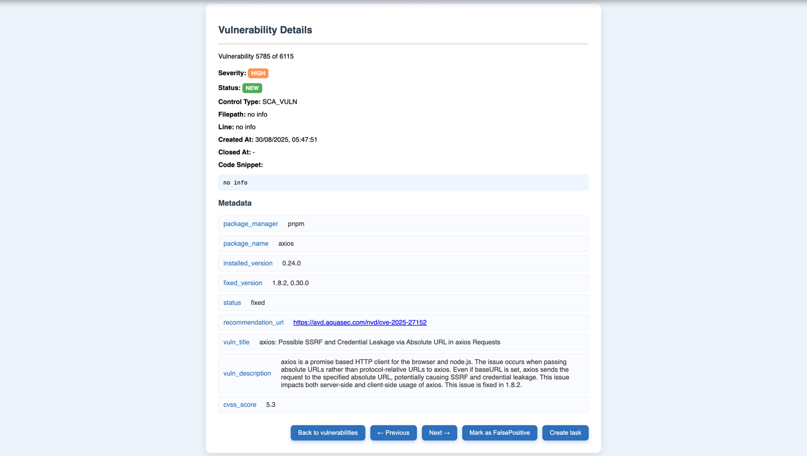
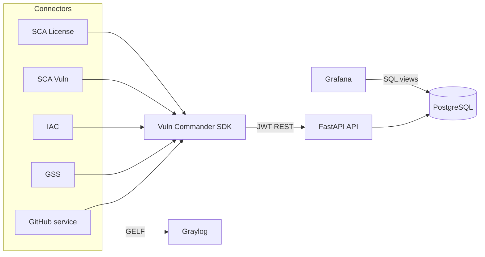

# Vuln Commander

Vuln Commander is an open-source Application Security platform. It aggregates findings from DevSecOps scanners and service connectors into a single database, exposes a REST API, provides a web UI for vulnerability management, and ships Grafana dashboards for analytics.

## Table of contents

1. [Platform overview](#1-platform-overview)
2. [Technology stack](#2-technology-stack)
3. [Architecture and data model](#3-architecture-and-data-model)
4. [SDK](#4-sdk)
5. [Clean install and run](#5-clean-install-and-run)

---

## 1. Platform overview

The platform provides centralized vulnerability tracking across repositories:

- **GitHub service connector** — registers projects (repositories), default branch metadata, and the latest commit.
- **DevSecOps connectors** — periodically clone projects, run scanners, and sync findings with the API:
  - **GSS** (secrets) — [Nosey Parker](https://github.com/praetorian-inc/noseyparker)
  - **IAC** — [KICS](https://github.com/Checkmarx/kics)
  - **SCA Vuln** / **SCA License** — [Trivy](https://github.com/aquasecurity/trivy)
- **API** — stores projects, vulnerabilities, and scan history; JWT authentication for users and connectors; role-based access control.
- **Vulnerability management** — HTML list and detail pages per project, filtering, status changes (including False Positive — in development).
- **Dashboards** — Grafana reads aggregated PostgreSQL views (overall stats and per-scanner breakdowns).








### Key capabilities

| Area | Description |
|------|-------------|
| Projects | Repository registration, teams (`ti` / `sandbox`), status (`active` / `archived`) |
| Vulnerabilities | Bulk create/update/close; lifecycle: `new` → `closed` / `reopened` |
| Connectors | Accounts with scope `service` or `devsecops`; per-project scan history |
| Users | Roles `user` / `admin`; access + refresh JWT |
| Observability | Connector logs in Graylog (GELF UDP), metrics in Grafana |

---

## 2. Technology stack

### Backend and data

| Component | Technology |
|-----------|------------|
| API | Python 3.12, FastAPI, Uvicorn, Gunicorn |
| ORM / migrations | SQLAlchemy 2, Alembic, asyncpg |
| Schema validation | Pydantic v2 |
| Database | PostgreSQL (Bitnami image) |
| Authentication | JWT (PyJWT), bcrypt |
| UI templates | Jinja2 |

### Connectors and SDK

| Component | Technology |
|-----------|------------|
| HTTP client | aiohttp |
| Scheduler | cron-converter (`Scheduler`) |
| Git operations | GitPython |
| Logging | loguru, pygelf → Graylog |
| Dependency management | [uv](https://github.com/astral-sh/uv) |
| Shared schemas | `shared/` package (`vuln-commander-shared`) |

### Infrastructure (Docker Compose)

| Service | Purpose | Host port |
|---------|---------|-----------|
| `api` | REST API + static assets | 8000 |
| `db` | PostgreSQL | 5432 |
| `db-ui` | pgAdmin | 8080 |
| `github`, `gss`, `iac`, `sca-license`, `sca-vuln` | Connectors | — |
| `graylog` + `graylog-datanode` + `graylog-mongodb` | Centralized logs | 9000 (UI) |
| `grafana` | Dashboards | 3000 |

### External scanners (bundled in connector images)

- Nosey Parker (GSS)
- KICS (IAC)
- Trivy (SCA)

---

## 3. Architecture and data model

### High-level diagram



### Repository layout

```
vuln-commander/
├── api/                 # REST API, Alembic migrations, UI templates
├── sdk/                 # Client library for connectors
├── shared/              # Shared Pydantic schemas and enums
├── connectors/
│   ├── connectors_spec.yml   # Connector registry for DB bootstrap
│   ├── service/github/       # Service connector
│   └── devsecops/            # GSS, IAC, SCA-*
├── grafana/             # Provisioning and dashboards
├── static/              # Docs assets, SQL for views
└── docker-compose.yml
```

### Data flow

1. **GitHub** reads a list of repository URLs on a schedule and calls `POST /api/v1/projects` — projects and commits are stored in the database.
2. A **DevSecOps connector** calls `GET /api/v1/projects/{connector_type}`, clones the repository, and runs a scanner.
3. The SDK performs **vulnerability synchronization** (`process_vulns`): new findings are created, missing ones are closed, previously closed ones are reopened when detected again.
4. After a scan, **history** is recorded via `POST /api/v1/connectors/history` (severity counters).
5. Grafana builds reports from SQL views (`vc_view_*`).

### REST API (`/api/v1`)

| Prefix | Purpose | Called by |
|--------|---------|-----------|
| `/auth` | Issue and refresh JWT | Users, connectors |
| `/users` | User management | Admin |
| `/projects` | Project CRUD / scanner project list | GitHub (`service`), connectors (`devsecops`) |
| `/vuln` | Bulk vulnerability operations, HTML UI | DevSecOps connectors, browser |
| `/connectors` | Connector management, scan history | Admin, DevSecOps |

Access control is based on **JWT scope**: `user` (admin/user role), `connector` (scope `service` / `devsecops`).

### PostgreSQL tables

| Table | Purpose |
|-------|---------|
| `vc_project` | Project: name, team, clone URL, branch, status |
| `vc_commit` | Latest known commit for a project |
| `vc_user` | Platform users |
| `vc_connector` | Connector accounts |
| `vc_refresh_token` | Refresh tokens (user or connector) |
| `vc_vuln` | Vulnerabilities (unique `hash`) |
| `vc_connector_scan_history` | Severity snapshot after a scan |

### Enumerations

- **UserTeam**: `ti`, `sandbox`
- **UserRole**: `user`, `admin`
- **ProjectStatus**: `active`, `archived`
- **ConnectorScope**: `service`, `devsecops`
- **ConnectorType**: `iac`, `gss`, `sca_license`, `sca_vuln`, `sast`, `github` (in code; in DB see migration `5db404bd006e_initial`)
- **VulnSeverity**: `info`, `low`, `medium`, `high`, `critical`
- **VulnStatus**: `new`, `awaiting_review`, `closed`, `false_positive`, `reopened`

### Vulnerability hash

Finding uniqueness is defined by an MD5 over:

`project_id`, `connector_type`, `severity`, `filepath`, `line`, `custom_fields` (JSON).

The same formula is used in `shared/schemas/vuln.py` and `sdk.src.utils.helpers.generate_vuln_hash`.

### SQL views (Grafana)

Created during migration from `api/migrations/views_generation_spec`:

- `vc_view_general_vulnerabilities_statistic` — project summary
- `vc_view_project_vulnerabilities_statistic` — per-project detail
- `vc_view_gss_vulnerabilities_statistic`, `vc_view_iac_*`, `vc_view_sca_*` — per-scanner breakdown

### Connector registry

The file `connectors/connectors_spec.yml` defines connectors for **one-time registration** on API startup (see `api/docker-entrypoint.sh`):

```yaml
- name: github
  env: GITHUB          # → CONNECTOR_GITHUB_UUID / CONNECTOR_GITHUB_PASSWORD
  scope: service
  type: github
```

---

## 4. SDK

Python library for building connectors: HTTP client to the API, vulnerability sync, cron scheduler, and Graylog logging.

**Full class and method reference:** [sdk/README.md](sdk/README.md)

Quick example:

```python
from sdk import Scheduler, VulnCommanderSDK
from shared.schemas.constants import ConnectorType

async def main():
    scheduler = Scheduler("0 12 */1 * *")  # cron
    for _ in scheduler:
        async with VulnCommanderSDK(connector_id, connector_password) as sdk:
            projects = await sdk.get_projects(ConnectorType.gss)
            # ... scan ...
            await sdk.process_vulns(actual_vulns, project.vulns)
```

Inside the Docker network, the default API URL is `http://api:8000/api/v1` (`sdk/src/utils/config.py`).

---

## 5. Clean install and run

### Requirements

- Docker and Docker Compose v2
- ~8 GB free RAM (Graylog + PostgreSQL + connectors)
- Internet access to pull/build images

### Step 1. Clone and environment variables

```bash
git clone <repository-url> vuln-commander
cd vuln-commander
cp .env.example .env
```

Edit `.env`:

- PostgreSQL, pgAdmin, Grafana, and Graylog passwords (`GRAYLOG_PASSWORD_SECRET` ≥ 16 characters)
- `GRAYLOG_ROOT_PASSWORD_SHA2` — SHA-256 hex of the Graylog admin password
- `ADMIN_*` — API admin account (created only when the database has no users yet)
- `CONNECTOR_*_UUID` and `CONNECTOR_*_PASSWORD` — must match `CONNECTOR_ID` / `CONNECTOR_PASSWORD` in each connector’s `.env`

### Step 2. Connector configuration

Create a `.env` file for each service in `docker-compose.yml` (not committed to the repo):

**`connectors/service/github/.env`**

```env
CONNECTOR_ID=<same UUID as CONNECTOR_GITHUB_UUID>
CONNECTOR_PASSWORD=<same password as CONNECTOR_GITHUB_PASSWORD>
CRON_SCHEDULE=0 12 */1 * *
PARALLEL_TASKS_COUNT=2
GRAYLOG_UDP_PORT=12201
```

**`connectors/devsecops/gss/.env`** (same pattern for `iac`, `sca-license`, `sca-vuln` with the matching UUIDs from `.env`):

```env
CONNECTOR_ID=<CONNECTOR_GSS_UUID>
CONNECTOR_PASSWORD=<CONNECTOR_GSS_PASSWORD>
CRON_SCHEDULE=0 12 */1 * *
PARALLEL_TASKS_COUNT=2
VULNS_REQUEST_BATCH_SIZE=100
GRAYLOG_UDP_PORT=12201
```

### Step 3. GitHub repository list

```bash
mkdir -p connectors/service/github
cat > connectors/service/github/projects.txt <<'EOF'
https://github.com/org/example-repo.git
EOF
```

One clone URL per line. The file is listed in `.gitignore`.

### Step 4. Start the stack

```bash
docker compose up -d --build
```

On first `api` startup:

1. Waits for PostgreSQL to become ready
2. Runs `alembic upgrade head`
3. Creates the admin user (if the DB is empty) and connectors from `connectors_spec.yml`

Full database initialization may take 1–2 minutes (PostgreSQL healthcheck `start_period` is up to 120 s).

### Step 5. Verify

| Service | URL | Notes |
|---------|-----|-------|
| API / OpenAPI | http://localhost:8000/docs | Swagger UI |
| pgAdmin | http://localhost:8080 | Credentials from `.env` |
| Grafana | http://localhost:3000 | `GF_SECURITY_ADMIN_*` |
| Graylog | http://localhost:9000 | Root password from SHA2 in `.env` |
| Vulnerability management | http://localhost:8000/api/v1/vuln/manage/{project_name} | After data is available |

API authentication: `POST /api/v1/auth/` with Basic Auth (user email + password, or `CONNECTOR_ID` + connector password).

### Step 6. Stop and full reset

```bash
# Stop
docker compose down

# Remove volumes (clean DB, Graylog, Grafana)
docker compose down -v
```

After `down -v`, the next `up` will run migrations and bootstrap again.

### Local development without Docker

```bash
# API (from repo root; PostgreSQL must be running)
export PYTHONPATH=$(pwd)
export POSTGRESQL_HOST=localhost
# ... remaining POSTGRESQL_* from .env
uv sync --project api
uv run --project api alembic -c api/alembic.ini upgrade head
uv run --project api python -m api.src.core.orm.initialisation.session
uv run --project api uvicorn api.src.main:app --reload --host 0.0.0.0 --port 8000
```

Run connectors from the `sdk/` directory with `PYTHONPATH` pointing at the monorepo root and `API_BASE_URL=http://localhost:8000/api/v1` (adjust `sdk/src/utils/config.py` or move the URL into an environment variable if needed).

---

## License

See [LICENSE](LICENSE).
